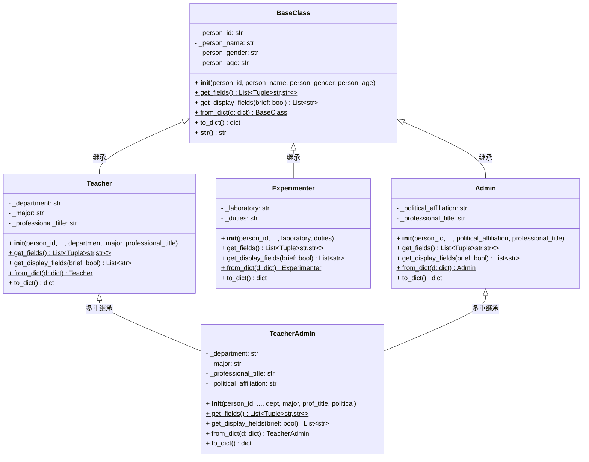
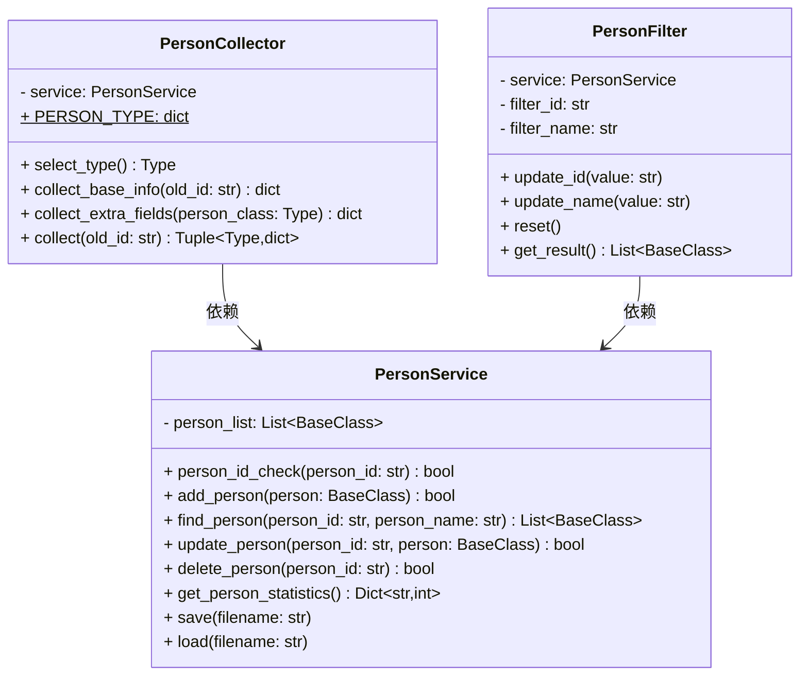

# UML 类图

> 高校人员信息管理系统 — 完整类图，使用 Mermaid classDiagram 语法。

## Model 层（数据模型）



## Service 层（业务逻辑）



## UI 层（用户界面）

```mermaid
classDiagram
    class CmdUI {
        - service: PersonService
        - collector: PersonCollector
        - auto_save_on: bool
        - MENU: dict$
        + run()
        + add_person()
        + find_person()
        + show_all_person()
        + update_person()
        + delete_person()
        + get_person_statistics()
        + auto_save()
        + manual_save()
        + manual_load()
        + export_csv()
        + import_csv()
        - _filter_list(title, action_name, pf) BaseClass
    }

    class PersonTuiApp {
        - service: PersonService
        - auto_save_on: bool
        + compose() ComposeResult
        + run()
        + action_save()
        + action_reload()
        + action_quit()
    }

    class PersonListPage {
        - service: PersonService
        - persons: List~BaseClass~
        - on_select_callback: Callable
        + compose() ComposeResult
        + on_list_view_selected(event)
        + on_list_view_highlighted(event)
    }

    class PersonFilterPage {
        - service: PersonService
        - action_name: str
        - person_filter: PersonFilter
        - current_list: List~BaseClass~
        + compose() ComposeResult
        + _do_filter()
        + _refresh_list()
        + _on_person_selected(person)
    }

    class PersonDetailScreen {
        + compose() ComposeResult
    }

    class PersonEditScreen {
        - person: BaseClass
        - service: PersonService
        + compose() ComposeResult
        + _collect_data() dict
        + _validate_data(data) str
        + _do_save(data)
    }

    class PersonAddScreen {
        - service: PersonService
        - selected_type: str
        + compose() ComposeResult
        + _rebuild_extra_fields()
        + _collect_data() dict
        + _validate_data(data) str
        + _do_save(data)
    }

    class PersonDeleteConfirmScreen {
        - person: BaseClass
        - service: PersonService
        + compose() ComposeResult
    }

    class CsvImportScreen {
        - service: PersonService
        + compose() ComposeResult
    }

    class RichPanelPage {
        - _panel: Panel
        + compose() ComposeResult
        + update_panel(new_panel)
    }

    class ConfirmScreen {
        - message: str
        - on_confirm: Callable
        + compose() ComposeResult
        + on_button_pressed(event)
    }

    CmdUI --> PersonService : 依赖
    CmdUI --> PersonCollector : 依赖
    PersonTuiApp --> PersonService : 依赖
    PersonListPage --> PersonService : 依赖
    PersonFilterPage --> PersonService : 依赖
    PersonFilterPage --> PersonFilter : 依赖
```



## 完整层次关系

```mermaid
classDiagram
    direction TB

    class BaseClass {
        <<abstract>>
        - _person_id
        - _person_name
        - _person_gender
        - _person_age
        + to_dict()
        + from_dict()
        + get_fields()
        + get_display_fields()
    }

    class Teacher {
        - _department
        - _major
        - _professional_title
    }

    class Experimenter {
        - _laboratory
        - _duties
    }

    class Admin {
        - _political_affiliation
        - _professional_title
    }

    class TeacherAdmin {
        - _department
        - _major
        - _professional_title
        - _political_affiliation
    }

    class PersonService {
        - person_list
        + CRUD操作
        + 持久化
        + 统计
    }

    class CmdUI {
        CLI界面
    }

    class PersonTuiApp {
        TUI界面
    }

    BaseClass <|-- Teacher
    BaseClass <|-- Experimenter
    BaseClass <|-- Admin
    Teacher <|-- TeacherAdmin
    Admin <|-- TeacherAdmin

    CmdUI --> PersonService
    PersonTuiApp --> PersonService
</mermaid>

## 说明

- `+` 表示公开方法，`-` 表示私有属性，`$` 表示静态/类方法
- 虚线箭头 `-->` 表示依赖关系（使用）
- 实线三角 `--|>` 表示继承关系
- `TeacherAdmin` 采用多重继承，同时继承 `Teacher` 和 `Admin`，通过直接调用 `BaseClass.__init__()` 绕开 MRO 问题